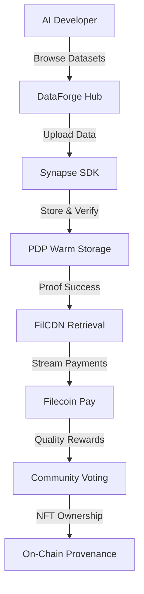

<div align="center">


# 🚀 DataForge Hub
### The Premier Marketplace for Verifiable AI Datasets on Filecoin

[](https://dataforge-verify.vercel.app/)
[](https://calibration.filfox.info/en/address/0x569C43c4Cb8e332037Bc02ae997177F35cd8a017)
[](https://github.com/mohamedwael201193/dataforge-verify)
[](https://opensource.org/licenses/MIT)

*Solving AI bias through cryptographically verifiable datasets with PDP proofs, FilCDN retrieval, and streaming payments.*

[[🏗️ Architecture](#️-deep-filecoin-onchain-cloud-integration) • [⚡ Quick Start](#-quick-start) • [🌟 Features](#-features) • [🤝 Contributing](#-contributing)

</div>

---

## 🌟 Wave 2 Achievement: Design → Live MVP

| **Wave 1** | **Wave 2** |
|------------|-------------|
| 📋 Design documents & architecture | 🚀 Live dApp on Filecoin Calibration |
| 🎨 User flow mockups | 💻 Interactive React MVP |
| 📊 Service integration plans | ⚡ Real smart contract deployment |
| 🔄 Static prototypes | 🔗 MetaMask wallet integration |
| 💡 Conceptual framework | 📊 Dynamic dashboards with live data |

**Contract Address**: [`0x569C43c4Cb8e332037Bc02ae997177F35cd8a017`](https://calibration.filfox.info/en/address/0x569C43c4Cb8e332037Bc02ae997177F35cd8a017)

---

## 🎯 The Problem We Solve

**80% of AI training data comes from just 5 centralized sources** - creating systemic bias in:
- 🏥 Healthcare algorithms
- 💰 Financial credit scoring
- 👥 Hiring and recruitment tools
- 🚗 Autonomous vehicle systems

**DataForge Hub democratizes AI data** through verifiable, decentralized datasets where provenance and quality are guaranteed on-chain.

---

## 🏗️ Deep Filecoin Onchain Cloud Integration

<div align="center">



</div>

### 🔐 PDP (Proof of Data Possession)
* **Beyond Cold Storage:** Enables "hot" interactive AI previews.
* **Visual Dashboard:** 30-day proof success calendar (95%+ uptime).
* **Trust Mechanism:** Payments auto-pause on failed proofs.

### ⚡ FilCDN Integration
* **Blazing Speed:** <1s dataset previews via global CDN.
* **Try Before You Buy:** Micro-payment sampling system.
* **SP Protection:** No egress cost concerns.

### 💰 Filecoin Pay Rails
* **USDFC Streaming:** Payments tied to PDP verification.
* **Flexible Models:** One-time or subscription access.
* **SLA-Native:** "Pay only for verified availability."

### 🎯 Synapse SDK Orchestration
* **Seamless Onboarding:** ProofSet creation simulation.
* **Developer Ready:** Full JavaScript/TypeScript integration.
* **Production Scaling:** Mock → Real service transition ready.

---

## 🌟 Features

### 📊 Verifiable Data Integrity
First-of-its-kind visualization showing:
* **PDP Proof Calendar:** Green/red heatmap of daily verification.
* **Bias Analysis Charts:** Interactive diversity metrics.
* **Provenance Timeline:** Complete ownership history.

### 💸 Pay-Per-Sample
* Micro-payments for dataset samples before full purchase.
* FilCDN-powered instant access to previews.
* Risk-free evaluation for AI developers.

### ✨ Web2-Like User Experience
* Frictionless browsing without wallet connection.
* Professional animations and responsive design.
* Clear transaction previews and error handling.

---

## 🎥 Demo Video

*Replace this with a link to your 2-minute walkthrough video!*

---

## ⚡ Quick Start

### Prerequisites
* Node.js 18+ and npm
* MetaMask browser extension
* Testnet FIL from a [Filecoin Faucet](https://faucet.calibration.fildev.network/)

### Installation
```bash
# Clone the repository
git clone [https://github.com/mohamedwael201193/dataforge-verify.git](https://github.com/mohamedwael201193/dataforge-verify.git)
cd dataforge-verify

# Install dependencies
npm install

# Start development server
npm run dev
```

### Environment Setup
Create a `.env.local` file in the root directory and add the following:
```bash
# Filecoin Calibration Testnet Configuration
REACT_APP_CONTRACT_ADDRESS=0x569C43c4Cb8e332037Bc02ae997177F35cd8a017
REACT_APP_RPC_URL=[https://api.calibration.node.glif.io/rpc/v1](https://api.calibration.node.glif.io/rpc/v1)
REACT_APP_CHAIN_ID=314159
REACT_APP_NETWORK_NAME="Filecoin - Calibration testnet"
REACT_APP_EXPLORER_URL=[https://calibration.filfox.info/en](https://calibration.filfox.info/en)
```

### MetaMask Network Setup
Add the Filecoin Calibration network to MetaMask:
- **Network Name:** `Filecoin - Calibration testnet`
- **RPC URL:** `https://api.calibration.node.glif.io/rpc/v1`
- **Chain ID:** `314159`
- **Currency:** `tFIL`
- **Block Explorer:** `https://calibration.filfox.info/en`

---

## 🛠️ Tech Stack

- **Frontend:** React, Tailwind CSS, Framer Motion
- **Blockchain:** Solidity, Hardhat, Ethers.js
- **Services:** Filecoin Onchain Cloud (PDP, FilCDN, Filecoin Pay), Synapse SDK
- **Tools:** Vercel, GitHub, Mermaid.js

---

## 📋 Smart Contract API

### Core Functions
```solidity
// Register new dataset (returns NFT token ID)
function registerDataset(
    string _name,
    string _description,
    string _cid,
    uint256 _price,
    bool _isVerified
) external onlyOwner returns (uint256);

// Process payment for dataset access
function processPayment(
    uint256 _tokenId,
    uint256 _amount
) external;

// Fetch dataset information
function getDataset(uint256 _tokenId)
    external view returns (Dataset memory);
```

### Events
```solidity
event DatasetRegistered(uint256 indexed tokenId, string cid, bool verified);
event PaymentProcessed(uint256 indexed tokenId, uint256 amount);
```

---

## 🗂️ Project Structure

```
dataforge-verify/
├── public/
│   ├── favicon.ico
│   └── index.html
├── src/
│   ├── components/
│   │   ├── Dashboard/
│   │   ├── DatasetCard/
│   │   ├── IntegrityDashboard/
│   │   └── WalletConnect/
│   ├── pages/
│   │   ├── Browse.jsx
│   │   ├── DatasetDetail.jsx
│   │   ├── Dashboard.jsx
│   │   └── ListDataset.jsx
│   ├── hooks/
│   │   ├── useContract.js
│   │   └── useWallet.js
│   ├── utils/
│   │   ├── contract.js
│   │   └── constants.js
│   └── App.jsx
├── README.md
├── package.json
└── .env.example
```

---

## 🚀 Deployment

### Vercel (Recommended)
1.  Connect your GitHub repository to Vercel.
2.  Add the environment variables from your `.env.local` file to the Vercel project settings.
3.  Deploy! Vercel will automatically build and deploy your app on every push to the main branch.

### Manual Deployment
```bash
# Build the app for production
npm run build

# The static files will be in the 'build' directory.
# You can deploy this folder to any static hosting service.
```

---

## 🧪 Testing

### Frontend Testing
```bash
# Run all tests
npm test

# Run tests with coverage report
npm test -- --coverage

# Run tests in watch mode
npm test -- --watch
```

### Smart Contract Testing
```bash
# Deploy to a local testnet (requires Hardhat)
npx hardhat node
npx hardhat run scripts/deploy.js --network localhost

# Run contract tests
npx hardhat test
```
### Manual Testing Checklist
- [ ] Wallet connection (MetaMask + Filecoin network).
- [ ] Browse datasets without a wallet connected.
- [ ] Register a new dataset (requires wallet + tFIL).
- [ ] View dataset details and integrity dashboard.
- [ ] Process payment transactions successfully.
- [ ] Dashboard correctly shows owned datasets and earnings.
- [ ] The entire site is mobile-responsive.
- [ ] Error handling works for network issues, insufficient funds, etc.

---

## 🎯 User Flows
1.  **Dataset Discovery (No Wallet Required):**
    `Landing Page → Browse → Search/Filter → Dataset Detail → Preview`
2.  **Dataset Registration (Wallet Required):**
    `List Dataset → Connect Wallet → Fill Form → Submit Transaction → Dashboard`
3.  **Dataset Purchase (Wallet Required):**
    `Dataset Detail → Connect Wallet → Choose Payment → Process Transaction → Access`

---

## 🔮 Roadmap

### Wave 3: Production Polish
- [ ] Real Synapse SDK integration for live storage deals.
- [ ] Advanced bias detection algorithms and visualizations.
- [ ] Community rating and review system.
- [ ] Bulk dataset management features.
- [ ] Full smart contract security audit.

### Wave 4: Market Launch
- [ ] Mainnet deployment with real FIL and USDFC.
- [ ] Partnership integrations (Hugging Face, Kaggle).
- [ ] Enterprise features and a dedicated API.
- [ ] Mobile app development (PWA or native).
- [ ] Governance token launch for the DAO.

---

## 🤝 Contributing

We welcome contributions from the community!

### Development Setup
```bash
# Fork the repository
git clone [https://github.com/your-username/dataforge-verify.git](https://github.com/your-username/dataforge-verify.git)

# Create a feature branch
git checkout -b feature/amazing-feature

# Make your changes and commit
git commit -m "Add amazing feature"

# Push to your fork and create a Pull Request
git push origin feature/amazing-feature
```

### Contribution Guidelines
* **🐛 Bug Reports:** Use GitHub Issues with detailed descriptions, screenshots, and steps to reproduce.
* **💡 Feature Requests:** Propose new ideas with clear use cases and benefits.
* **📖 Documentation:** Help improve setup guides, API docs, and comments.

---

## 🌟 Community & Support

- **💬 Community:** Join the [Filecoin Slack](https://filecoin.io/slack) for discussions.
- **🐦 Updates:** Follow [@Filecoin](https://twitter.com/Filecoin) for ecosystem news.
- **📧 Direct Support:** Open a [GitHub Issue](https://github.com/mohamedwael201193/dataforge-verify/issues) for technical questions.
- **🎥 Office Hours:** Attend the weekly Filecoin community calls.

---

## 📄 License

This project is licensed under the MIT License - see the `LICENSE` file for details.

---

## 🙏 Acknowledgments

* **Filecoin Team:** For the amazing Onchain Cloud infrastructure.
* **OpenZeppelin:** For battle-tested smart contract security.
* **Vercel:** For seamless deployment and hosting.

<div align="center">

⭐ *Star this repo if you found it helpful!* ⭐

*Made with 💜 for the Filecoin ecosystem.*

</div>
